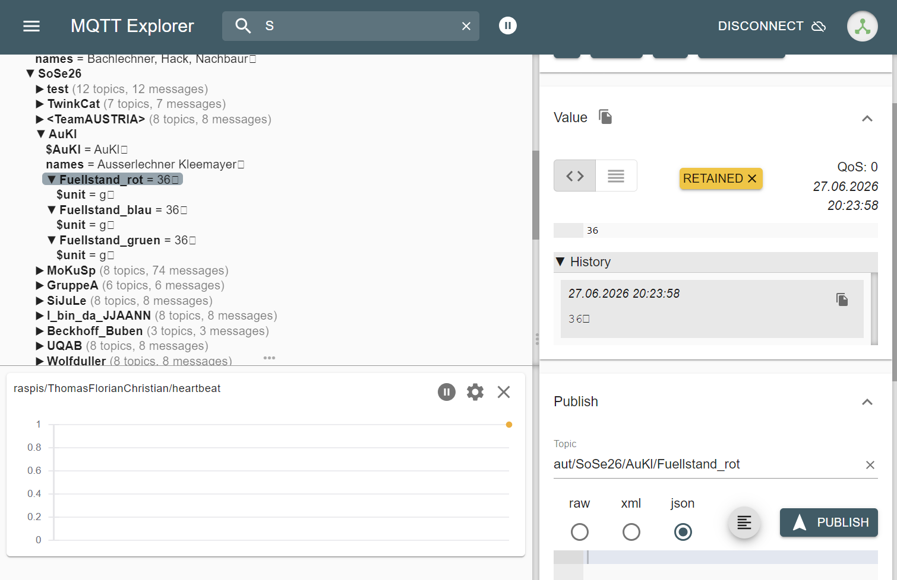

# Automatisierungstechnik – IIoT Projekt
## Aufgabe 12 – Datenanalyse mit Python

**Name:**  Mathias Außerlechner & Thomas Kleemayr  

**Projekt:** MQTT-Datenerfassung, Visualisierung, Regression und Klassifikation

---

# Projektübersicht

Im Rahmen dieser Aufgabe wurden Sensordaten der Learning Factory über MQTT empfangen, verarbeitet und in einer CSV-Datei gespeichert. Anschließend wurden die Daten visualisiert sowie zwei Machine-Learning-Aufgaben umgesetzt:

- Live-Datenerfassung über MQTT
- Speicherung der Messdaten in einer CSV-Datei
- Live-Visualisierung der Messdaten
- Regressionsmodell zur Vorhersage des Flaschenendgewichts
- Klassifikationsmodell zur Erkennung defekter Flaschen


---

# Aufgabe 1 – MQTT-Client

## Umsetzung

Das TwinCAT-Programm wurde um einen MQTT-Client erweitert. Dieser sendet Sensordaten der Learning Factory an den MQTT-Broker.

Übertragen werden:

- Gruppenname
- Nachnamen der Gruppenmitglieder
- Messwerte der Learning Factory
- SI-Einheiten der Messwerte

Die statischen Informationen wie Gruppenname, Namen und Einheiten werden einmalig beim Start gesendet. Die Messwerte werden zyklisch alle 10 Sekunden übertragen.

Alle MQTT-Nachrichten werden mit dem Retain-Flag gesendet. Dadurch bleiben die zuletzt gesendeten Werte am Broker gespeichert und können zum Beispiel mit MQTT-Explorer überprüft werden.

Verwendetes Topic-Schema:

| Topic | Inhalt | Zeitpunkt |
|------|--------|-----------|
| `aut/SoSe26/<Gruppe>/$groupsname` | Name der Gruppe | einmalig beim Start |
| `aut/SoSe26/<Gruppe>/names` | Nachnamen der Mitglieder | einmalig beim Start |
| `aut/SoSe26/<Gruppe>/<Größe>` | Messwert | alle 10 Sekunden |
| `aut/SoSe26/<Gruppe>/<Größe>/$unit` | SI-Einheit | einmalig beim Start |

---



---

# Aufgabe 2 – Live-Visualisierung

Für die Visualisierung wurde ein Jupyter Notebook verwendet.

Das Notebook liest die CSV-Datei in regelmäßigen Abständen ein und aktualisiert automatisch das Diagramm.

Die eingelesenen Daten werden in **database/data.csv** gespeichert.

Dargestellt wird:

- Final Weight über der Zeit

Dadurch kann die Entwicklung der Produktionsdaten live beobachtet werden.


---

# Aufgabe 3 – Regression

## Ziel

Vorhersage des finalen Flaschengewichts.

Es wurden drei lineare Regressionsmodelle trainiert.

## Ergebnisse

<div>
<style scoped>
    .dataframe tbody tr th:only-of-type {
        vertical-align: middle;
    }

</style>
<table border="1" class="dataframe">
  <thead>
    <tr style="text-align: right;">
      <th></th>
      <th>Genutzte Spalten (X)</th>
      <th>Modell-Typ</th>
      <th>MSE Training</th>
      <th>MSE Test</th>
    </tr>
  </thead>
  <tbody>
    <tr>
      <th>0</th>
      <td>fill_level_grams_red, 
      fill_level_grams_blue, 
      fill_level_grams_green</td>
      <td>Linear</td>
      <td>11.288824</td>
      <td>16.015207</td>
    </tr>
    <tr>
      <th>1</th>
      <td>fill_level_grams_red, fill_level_grams_blue, fill_level_grams_green, vibration_index_red, vibration_index_blue, vibration_index_green</td>
      <td>Linear</td>
      <td>0.120408</td>
      <td>0.141158</td>
    </tr>
    <tr>
      <th>2</th>
      <td>fill_level_grams_red, fill_level_grams_blue, fill_level_grams_green, vibration_index_red, vibration_index_blue, vibration_index_green, temperature_red, temperature_blue, temperature_green</td>
      <td>Linear</td>
      <td>0.119477</td>
      <td>0.139538</td>
    </tr>
  </tbody>
</table>
</div>

---

## Bestes Modell

### Verwendete Features

- fill_level_grams_red
- fill_level_grams_blue
- fill_level_grams_green
- vibration_index_red
- vibration_index_blue
- vibration_index_green
- temperature_red
- temperature_blue
- temperature_green

**MSE Training:** 0.119477

**MSE Test:** 0.139538

---

## Formel des bestes Modell

```
y = 
(0.000366 * fill_level_grams_red) + 
(0.000230 * fill_level_grams_blue) + 
(0.000291 * fill_level_grams_green) + 
(0.098992 * vibration_index_red) + 
(0.075775 * vibration_index_blue) + 
(0.099542 * vibration_index_green) + 
(-0.007582 * temperature_red) + 
(0.031290 * temperature_blue) + 
(0.000579 * temperature_green) + 
4.542869
```

---

## Vorhersage

Mit dem besten Modell wurden anschließend die Daten aus `X.csv` vorhergesagt.

Die Ergebnisse befinden sich in

```
regression/reg_Außerlechner-Kleemayr.csv
```

Hier die Vorschau zu den regessions Daten:

<div>
<style scoped>
    .dataframe tbody tr th:only-of-type {
        vertical-align: middle;
    }

</style>
<table border="1" class="dataframe">
  <thead>
    <tr style="text-align: right;">
      <th></th>
      <th>Flaschen ID</th>
      <th>y_hat</th>
    </tr>
  </thead>
  <tbody>
    <tr>
      <th>0</th>
      <td>368</td>
      <td>51.371767</td>
    </tr>
    <tr>
      <th>1</th>
      <td>369</td>
      <td>49.215247</td>
    </tr>
    <tr>
      <th>2</th>
      <td>370</td>
      <td>49.710928</td>
    </tr>
    <tr>
      <th>3</th>
      <td>371</td>
      <td>26.581392</td>
    </tr>
    <tr>
      <th>4</th>
      <td>372</td>
      <td>25.574183</td>
    </tr>
  </tbody>
</table>
</div>

---


# Aufgabe 4 – Klassifikation

## Ziel

Vorhersage, ob eine Flasche defekt oder intakt ist.

Für jedes Sensorsignal wurden verschiedene Merkmale berechnet:

- Mean
- Standardabweichung
- Maximum
- Minimum
- Peak-to-Peak
- RMS
- Energie
- Absoluter Mittelwert
- Standardabweichung der Differenzen
- Zero Crossings

Anschließend wurden verschiedene Kombinationen dieser Merkmale getestet.

Als Klassifikationsmodell wurde ein Random Forest verwendet.

---

# Ergebnisse der Merkmalskombinationen


<div>
<style scoped>
    .dataframe tbody tr th:only-of-type {
        vertical-align: middle;
    }

</style>
<table border="1" class="dataframe">
  <thead>
    <tr style="text-align: right;">
      <th></th>
      <th>Genutzte Features</th>
      <th>Modell-Typ</th>
      <th>F1-Score (Training)</th>
      <th>F1-Score (Test)</th>
    </tr>
  </thead>
  <tbody>
    <tr>
      <th>0</th>
      <td>mean(), std()</td>
      <td>Random Forest</td>
      <td>0.915254</td>
      <td>0.750000</td>
    </tr>
    <tr>
      <th>1</th>
      <td>mean(), std(), max(), min()</td>
      <td>Random Forest</td>
      <td>0.931034</td>
      <td>0.666667</td>
    </tr>
    <tr>
      <th>2</th>
      <td>alle berechneten Features</td>
      <td>Random Forest</td>
      <td>0.915254</td>
      <td>0.625000</td>
    </tr>
    <tr>
      <th>3</th>
      <td>mean(), std(), max(), min(), peak_to_peak(), r...</td>
      <td>Random Forest</td>
      <td>0.931034</td>
      <td>0.615385</td>
    </tr>
    <tr>
      <th>4</th>
      <td>alle berechneten Features</td>
      <td>Log. Regression</td>
      <td>0.287425</td>
      <td>0.378378</td>
    </tr>
    <tr>
      <th>5</th>
      <td>mean(), std(), max(), min(), peak_to_peak(), r...</td>
      <td>kNN</td>
      <td>0.512821</td>
      <td>0.250000</td>
    </tr>
    <tr>
      <th>6</th>
      <td>mean(), std()</td>
      <td>Log. Regression</td>
      <td>0.170455</td>
      <td>0.227273</td>
    </tr>
    <tr>
      <th>7</th>
      <td>alle berechneten Features</td>
      <td>kNN</td>
      <td>0.500000</td>
      <td>0.222222</td>
    </tr>
    <tr>
      <th>8</th>
      <td>mean(), std(), max(), min()</td>
      <td>Log. Regression</td>
      <td>0.153005</td>
      <td>0.146341</td>
    </tr>
    <tr>
      <th>9</th>
      <td>mean(), std(), max(), min(), peak_to_peak(), r...</td>
      <td>Log. Regression</td>
      <td>0.146597</td>
      <td>0.142857</td>
    </tr>
    <tr>
      <th>10</th>
      <td>mean()</td>
      <td>Random Forest</td>
      <td>0.739726</td>
      <td>0.090909</td>
    </tr>
    <tr>
      <th>11</th>
      <td>mean()</td>
      <td>Log. Regression</td>
      <td>0.172662</td>
      <td>0.066667</td>
    </tr>
    <tr>
      <th>12</th>
      <td>mean()</td>
      <td>kNN</td>
      <td>0.000000</td>
      <td>0.000000</td>
    </tr>
    <tr>
      <th>13</th>
      <td>mean(), std()</td>
      <td>kNN</td>
      <td>0.590909</td>
      <td>0.000000</td>
    </tr>
    <tr>
      <th>14</th>
      <td>mean(), std(), max(), min()</td>
      <td>kNN</td>
      <td>0.512821</td>
      <td>0.000000</td>
    </tr>
  </tbody>
</table>
</div>

---

# Bestes Modell

**Random Forest**

Features:

```
mean(), std()
```

Trainingsgenauigkeit:

```
0.9152542372881356
```

Testgenauigkeit:

```
0.75
```

---

# Konfusionsmatrix


# Interpretation

Die Confusion Matrix zeigt, dass das Modell insgesamt eine hohe Klassifikationsgenauigkeit von etwa 94 % erreicht. Von 95 intakten Flaschen wurden 91 korrekt erkannt, lediglich 4 wurden fälschlicherweise als defekt klassifiziert. Von 7 tatsächlich defekten Flaschen wurden 5 korrekt erkannt, während 2 Defekte übersehen wurden. Das Modell erkennt intakte Flaschen somit sehr zuverlässig, während die Erkennung defekter Flaschen aufgrund ihrer geringen Anzahl im Datensatz etwas schwieriger ist. Insgesamt eignet sich das Modell gut zur Erkennung von Flaschenzuständen, weist jedoch noch Verbesserungspotenzial bei der Erkennung seltener Defekte auf.

---

# Verwendete Bibliotheken

- pandas
- numpy
- matplotlib
- scikit-learn
- paho-mqtt

---

# Fazit

Im Rahmen dieser Aufgabe wurde eine vollständige Datenpipeline umgesetzt.

Diese umfasst:

- MQTT-Datenerfassung
- Speicherung der Messdaten
- Live-Visualisierung
- Regressionsanalyse
- Klassifikation mittels Machine Learning

Die Modelle konnten erfolgreich trainiert werden und wurden anschließend auf unbekannte Daten angewendet.
